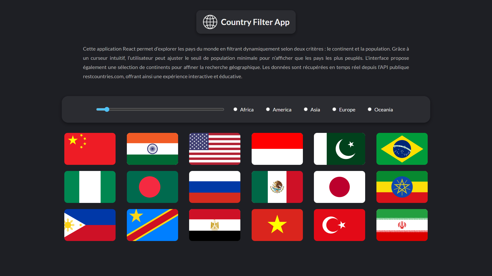

<div align="center">  
  <a href="https://country-filter-app.vercel.app" target="_blank">  
      
  </a>  
  </br></br>  
  <h3 align="center">🌍 Country Filter App</h3>  
</div>

## <br /> 📌 Sommaire

&nbsp;&nbsp;&nbsp; 🎨 &nbsp; [**Introduction**](#introduction)<br />
&nbsp;&nbsp;&nbsp; 🛠️ &nbsp; [**Technologies**](#technologies)<br />
&nbsp;&nbsp;&nbsp; 🎯 &nbsp; [**Fonctionnalités**](#fonctionnalités)<br />
&nbsp;&nbsp;&nbsp; 🚀 &nbsp; [**Installation**](#installation)<br />

## <br /> <a name="introduction">🎨 Introduction</a>

**Country Filter App** est une application React interactive qui permet de découvrir et filtrer les pays du monde en fonction de leur **continent** et de leur **population**. Elle propose une interface simple, fluide et responsive, avec un **design en dark mode**.

## <br /> <a name="technologies">🛠️ Technologies</a>

- React (Create React App)
- SCSS
- Axios
- Vite ou Webpack (CRA)
- API [REST Countries v3.1](https://restcountries.com/v3.1/all)
- Déploiement sur [Vercel](https://country-filter-api.vercel.app/)

## <br /> <a name="fonctionnalités">🎯 Fonctionnalités</a>

- Filtrer les pays par continent : Africa, America, Asia, Europe, Oceania
- Curseur de population minimale pour afficher les pays les plus peuplés
- Affichage des drapeaux
- Affichage de la capitale et de la population totale
- Design responsive et en mode sombre

## <br /> <a name="installation">🚀 Installation</a>

### ✅ Pré-requis

- 🛠️ **[Git](https://git-scm.com/)**
- 🔧 **[Node.js](https://nodejs.org/fr/)**
- 📦 **[npm](https://www.npmjs.com/)**

### 📥 Cloner le projet

```bash
git clone https://github.com/ValentinMadiot/country-filter_api.git
```

### ▶️ Lancer l’application

#### Frontend (port : 3000)

```bash
cd country-filter_api
npm install
npm start
```
